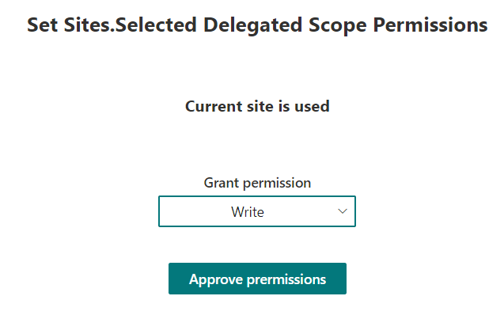
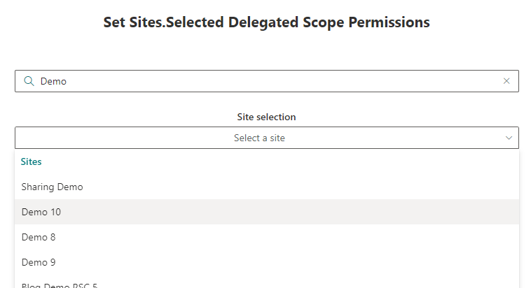
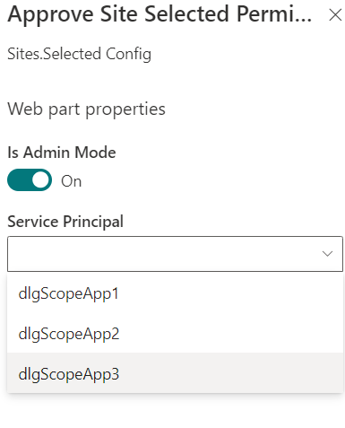

# react-site-selected-delgt-apprvr

## Summary

This web part allows the using Administrator to apply permissions based on the new RSC (Resource Specific Consent) and Site.Selected scope to a given inside app registration. Either to the current site one or one of a Graph search result.

|Using current site|
:-------------------------:

|Select site|
:-------------------------:

|Configure web part (isAdminMode=Search sites)|
:-------------------------:

## Used SharePoint Framework Version

## Applies to

- [SharePoint Framework](https://aka.ms/spfx)
- [Microsoft 365 tenant](https://docs.microsoft.com/en-us/sharepoint/dev/spfx/set-up-your-developer-tenant)

## Version history

Version|Date|Author|Comments
-------|----|--------|--------
1.0|January 31, 2024|[Markus Moeller](http://www.twitter.com/moeller2_0)|Initial release

## Disclaimer

**THIS CODE IS PROVIDED _AS IS_ WITHOUT WARRANTY OF ANY KIND, EITHER EXPRESS OR IMPLIED, INCLUDING ANY IMPLIED WARRANTIES OF FITNESS FOR A PARTICULAR PURPOSE, MERCHANTABILITY, OR NON-INFRINGEMENT.**

---

## Minimal Path to Awesome

- Clone this repository
- Ensure that you are at the solution folder
- To grant necessary MS Graph permissions for some functionality
  - Either grant them manually (see package-solution.json which ones)
  - Grant them via Admin center
  - in the command-line run:
  - `gulp bundle --ship`
  - `gulp package-solution --ship`
  - Upload app to app catalog
  - Enable
  - Grant requested permissions via API access as suggested
- in the command-line run:
  - **npm install**
  - **gulp serve**

## Features

Description of the extension that expands upon high-level summary above.

This extension illustrates the following concepts:

- [SharePoint now supports delegated Sites.Selected authentication](https://devblogs.microsoft.com/microsoft365dev/sharepoint-now-supports-delegated-sites-selected-authentication/)
- [Create site permissions](https://learn.microsoft.com/en-us/graph/api/site-post-permissions?view=graph-rest-1.0&tabs=http&WT.mc_id=M365-MVP-5004617)
- [Search for sites](https://learn.microsoft.com/en-us/graph/api/site-search?view=graph-rest-1.0&tabs=http&WT.mc_id=M365-MVP-5004617)

